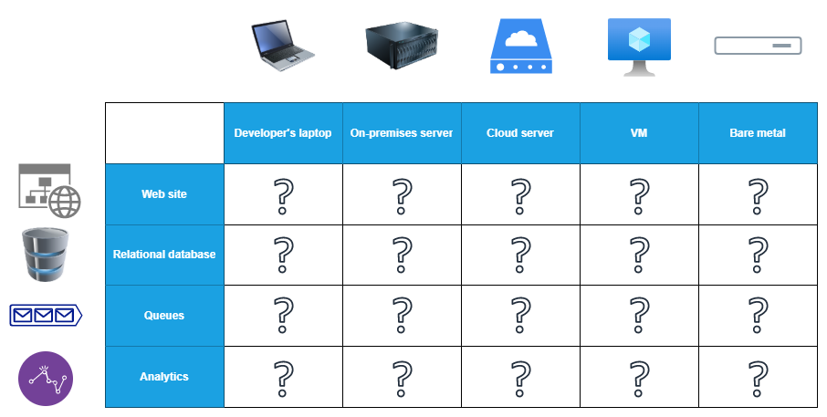
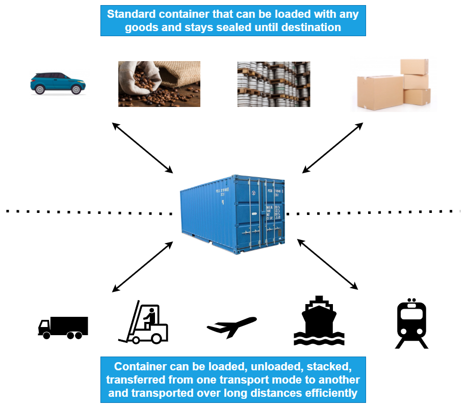
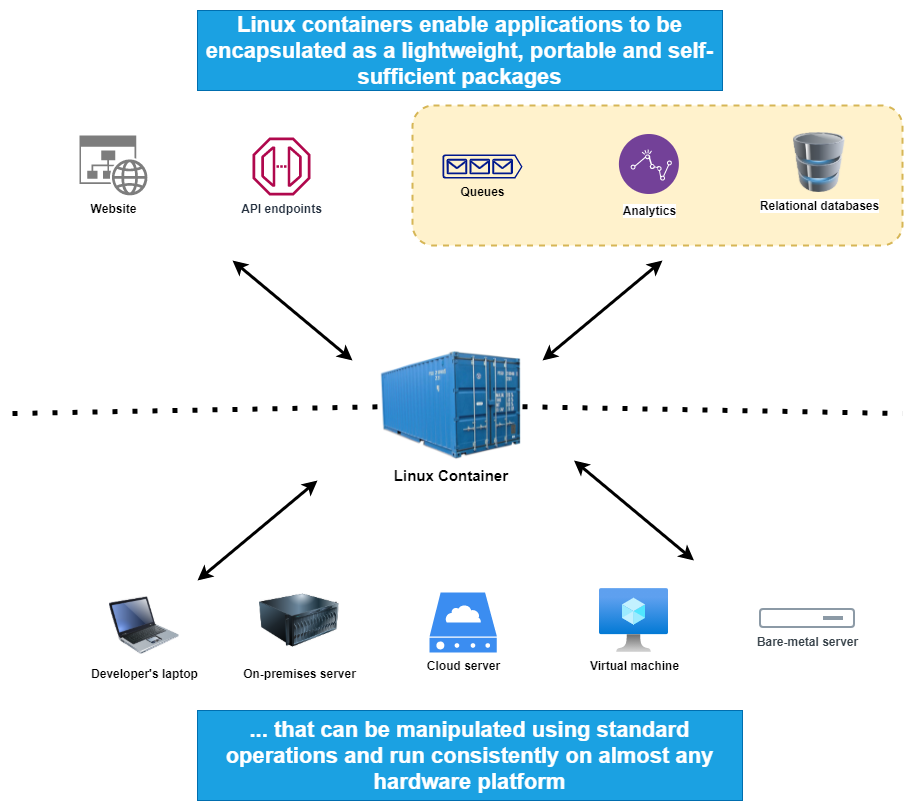

<!-- .slide: data-background-image="images/paul-teysen-bukjsECgmeU-unsplash.jpg" -->
# Introduction to Linux Containers

---

## Objectives

- Introduction to Linux Containers for non technical people.
- Explain what problems do Linux Containers solve.

---

## The hype about Linux containers

- The way we develop software is evolving.

- Before (can still be current for some of us ...)

  - Monolithic application
  - Long development cycle (waterfall methodology)
  - Vertical scaling focused (add CPU, memory and disks aka run on more powerful hardware)

- Now:

  - Loosely coupled services
  - _Agile_ development
  - Horizontal scaling (running multiple replicas)

---

## Deployment becomes more complex

- Many different stacks used

  - Languages
  - Frameworks

- Many different targets:

  - Individual development environments
  - Test, QA, preproduction, ...
  - On-premises and/or cloud service provider

---

## The deployment problem

---

## The deployment matrix from hell

---

## Parallel with the shipping industry

---

## intermodal shipping containers

---

## A new shipping ecosystem

- 90% of all cargo is now shipped in standard containers
- Faster load / unload of ships
- Drastic reduction of losses due to theft and/or damages

---

## Containers for applications

Warning: it is possible to package stateful applications like databases or message brokers in containers but it requires more expertise because data persistence in containers is tricky.

---

## Technical advantages

- Easier packaging / deployment of applications.
- Faster onboarding of new developers (package environments as containers).
- Implement better _Continuous Integration_ (containers are faster to create than VMs and leave your CI environment clean).
- Use container images as build artefacts, store them in registry with multiple versions (enables easy rollback in case of issue), deploy the same image in all environments.
- And many more ...

---

## Additional sources of information

If you want to know more about Linux containers and specifically about Docker engine, consult the following resources:

- Jerome Petazzoni's self-paced [Introduction to Docker and Containers](https://container.training/intro-selfpaced.yml.html) (FREE).
- Nana Janashia's [Docker Tutorial for Beginners](https://youtu.be/3c-iBn73dDE) on Youtube (FREE).
- Bret Fisher's [Docker Mastery](https://www.udemy.com/course/docker-mastery/) course on Udemy.

---

<!-- .slide: data-background-image="images/paul-teysen-bukjsECgmeU-unsplash.jpg" -->
# Thank you !

