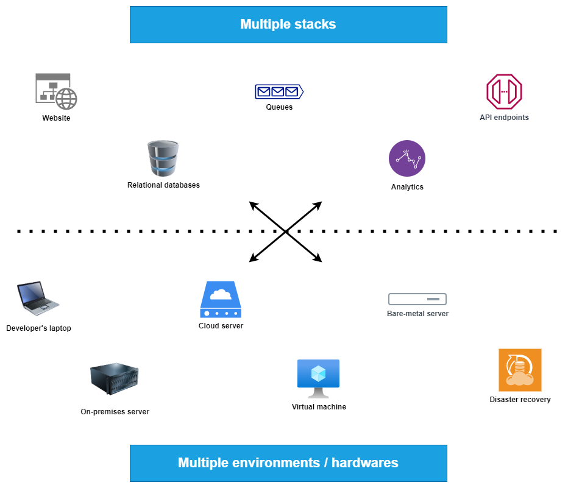
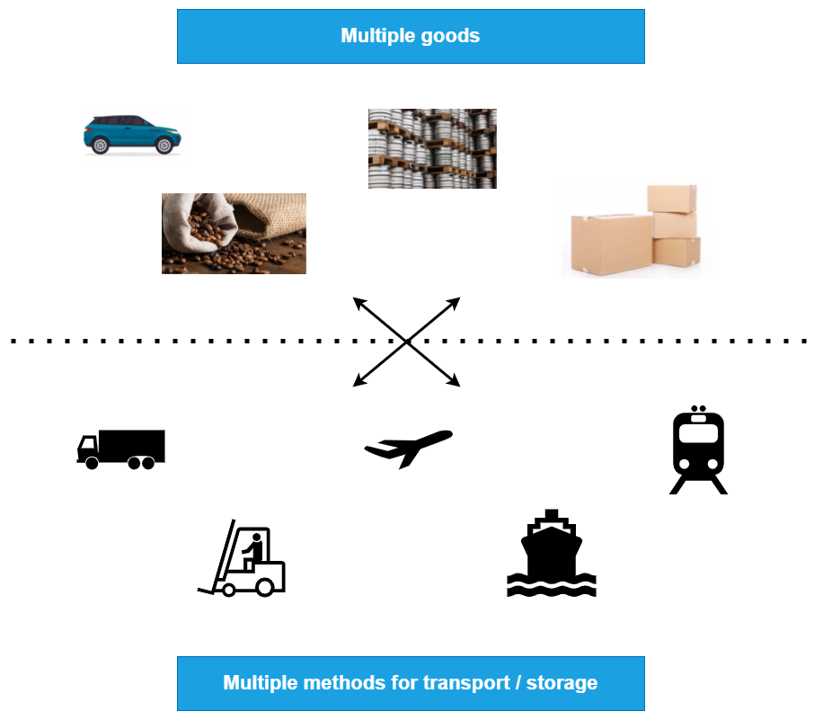

# Introduction to Linux Containers

---

## Summary

1. Objectives

1. The hype about Linux containers

1. Deployment complexity

1. Parallel with shipping industry

1. Intermodal shipping containers

1. Shipping containers eco-system

1. Shipping container system for applications

1. Benefits

---

## Objectives

- This slide deck is an introduction to Linux Containers for non technical people.

- We won't run any container nor explore deep technical details on how containers are implemented here.

---

## The hype about Linux containers

- The way we develop software is evolving.

- Before (can still be current for some of us :wink: )
  - Monolithic application
  - Long development cycle (waterfall methodology)
  - Vertical scaling focused (add CPU, memory and disks aka run on a beefier hardware)

- Now:
  - loosely coupled services
  - _Agile_ development
  - Horizontal scaling (running multiple replicas)

---

## Deployment becomes more complex

- Many different stacks used

  - Languages
  - Frameworks (think .Net or Java version dependency)

- Many different targets:

  - individual development environments
  - test, QA, preproduction, ...
  - on-premises and/or cloud service provider

---

## The deployment problem

---

## The deployment matrix from hell

---

## Parallel with the shipping industry

---

## The solution : intermodal shipping containers

## A new shipping ecosystem

- 90% of all cargo is now shipped in standard containers
- faster load / unload of ships
- drastic reduction of losses due to theft and/or damages

---

## Linux containers = shipping containers for applications

> Remark : it is possible to package stateful applications like databases or message brokers in containers but it requires more expertise because data persistence in containers can be tricky.

---

# Some technical stuff !

---

## No more dependency hell

- Application packaging can be resumed to the following steps :

  1. Define, test and document (example in `INSTALL.txt` file) installation instructions.

  2. Create some installation script that works for you as developer.

  3. Turn this into a `Dockerfile` (or a container build file).

  4. Build the container image and test it.

  5. If the container works on your machine, it will work on every other machines that can run containers.

  ---

## Other use cases for Linux containers

- Faster onboarding of new developers (package environments as containers).

- Implement better Continous Integration (containers are faster to create than VMs and leave your CI environment clean).

- Use container images as build artefacts, store them in registry with multiple versions (enables easy rollback in case of issue), deploy the same image in all environments.

---

## Container engines

- Container engines provide 3 important things to ease the use of containers
  
  1. User interface / API.

  2. Capability to push / pull container images.

  3. Create configuration file (`config.json`) for container runtimes (the tool that effectively runs the container).

- Most known container engine is [Docker](https://www.docker.com/), but other alternatives like [podman](https://podman.io/) or [LXD](https://linuxcontainers.org/lxd/introduction/) are growing fast due to some issues with the Docker implementation.

